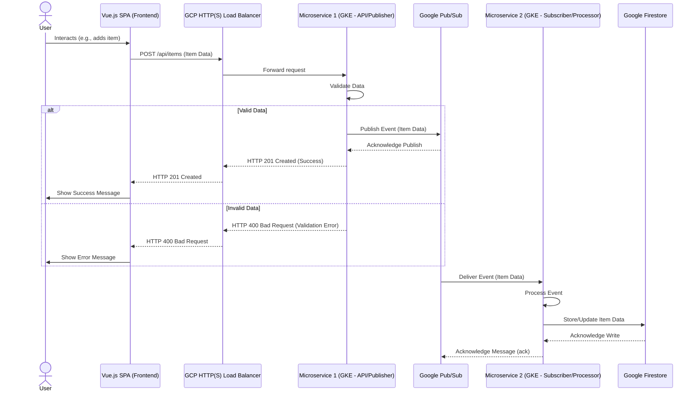
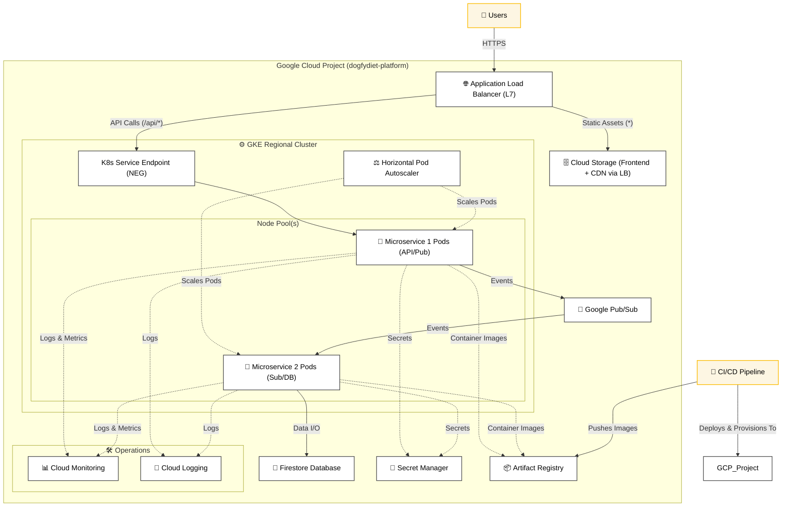

# Architecture Overview

This document provides a detailed overview of the DogfyDiet Cloud Platform's architecture, including its components and how they interact.

## High-Level Design

The platform follows a microservices pattern with a decoupled frontend, asynchronous backend processing, and infrastructure managed as code.

* **User Interface**: A dynamic Single Page Application (SPA) built with Vue.js.
* **API Layer**: Microservice 1 acts as an API gateway, handling initial user requests.
* **Event-Driven Processing**: Google Pub/Sub is used for asynchronous communication between Microservice 1 and Microservice 2.
* **Data Persistence**: Microservice 2 processes events and stores data in Google Firestore.
* **Scalability & Orchestration**: Backend microservices are containerized with Docker and orchestrated by Google Kubernetes Engine (GKE).
* **Global Delivery**: Frontend assets are served from Google Cloud Storage (GCS) via an HTTP(S) Load Balancer with Cloud CDN.

## System Flow Diagram Architecture Diagram

## High-Level Component Architecture Diagram

## Component Breakdown

### 1. Networking (VPC)
* **Custom VPC (`dogfydiet-dev-vpc`)**: Segregated network environment. 
    * **Subnets**: Private (`dogfydiet-dev-private-subnet` for GKE nodes) and Public (`dogfydiet-dev-public-subnet`) subnets in `us-central1`. 
    * **Cloud NAT (`dogfydiet-dev-nat`)**: Enables outbound internet connectivity for resources in private subnets (e.g., GKE nodes pulling images). 
    * **Firewall Rules**:
        * `allow-internal`: For communication within the VPC. 
        * `allow-http-https`: Allows external traffic to the Load Balancer on ports 80/443. 
        * `allow-ssh`: For SSH access (should be restricted to specific IPs in production).
        * `allow-gke-master`: Facilitates communication between GKE master and nodes. 
        * `allow-lb-health-checks-to-gke-nodes`: Allows LB health checks to Microservice 1.

### 2. Compute & Orchestration (GKE)
* **Google Kubernetes Engine Cluster (`dogfydiet-dev-cluster`)**: Managed Kubernetes service.
    * **Regional Cluster**: Located in `us-central1` for high availability within the region.
    * **Private Nodes**: GKE nodes reside in the private subnet. 
    * **Public Endpoint**: The Kubernetes API server endpoint is publicly accessible but protected by Master Authorized Networks (currently `0.0.0.0/0`, **NEEDS RESTRICTION FOR PROD**). 
    * **Node Pools (`dogfydiet-dev-node-pool`)**: Managed group of GKE worker nodes with autoscaling.
    * **Workload Identity**: Enabled for secure, keyless authentication from GKE pods to GCP services. 
    * **Helm Charts**: Used for deploying Microservice 1 and Microservice 2 onto GKE.

### 3. Frontend Hosting & Delivery
* **Google Cloud Storage (GCS)**: Bucket (e.g., `dogfydiet-dev-frontend-xxxx`) hosts the static build artifacts of the Vue.js SPA. 
* **HTTP(S) Load Balancer**: Global external load balancer.
    * Serves frontend content from the GCS bucket via a backend bucket configuration. 
    * **Cloud CDN**: Enabled for the GCS backend bucket to cache frontend assets closer to users, improving performance. 
    * **SSL Termination**: Handles SSL with a Google-managed certificate for `nahueldog.duckdns.org`. 
    * **Path-Based Routing**: Directs traffic starting with `/api/` to Microservice 1 on GKE; all other traffic goes to the GCS bucket. 

### 4. Messaging (Pub/Sub)
* **Topic (`dogfydiet-dev-items-topic`)**: Microservice 1 publishes events related to item creation here. 
* **Subscription (`dogfydiet-dev-items-subscription`)**: Microservice 2 subscribes to this topic to receive and process events. 
* **Dead-Letter Topic (DLT)**: `dogfydiet-dev-items-dead-letter-topic` and its subscription are configured to handle messages that Microservice 2 fails to process after multiple retries. 

### 5. Database (Firestore)
* **Firestore Native Mode**: NoSQL document database used by Microservice 2 to store item data. 
    * **Location**: `us-central1` (aligns with other regional services). 
    * **Collection**: Data is organized into collections (e.g., `items`, as per Microservice 2 environment variable `FIRESTORE_COLLECTION` ).

### 6. Application Details
* **Frontend (`applications/frontend`)**: A Vue.js 3 SPA allowing users to add items to a list. It interacts with Microservice 1.
* **Microservice 1 (`applications/microservice-1`)**: Node.js/Express API.
    * Receives requests from the frontend (e.g., to add an item). 
    * Validates incoming data. 
    * Publishes an event to the Pub/Sub topic upon successful processing. 
* **Microservice 2 (`applications/microservice-2`)**: Node.js/Express application.
    * Subscribes to the Pub/Sub topic. 
    * Processes incoming messages (events). 
    * Stores or updates data in Firestore. 

*(Refer to `docs/security_practices.md` and `docs/monitoring_observability.md` for details on IAM and Security components.)*
